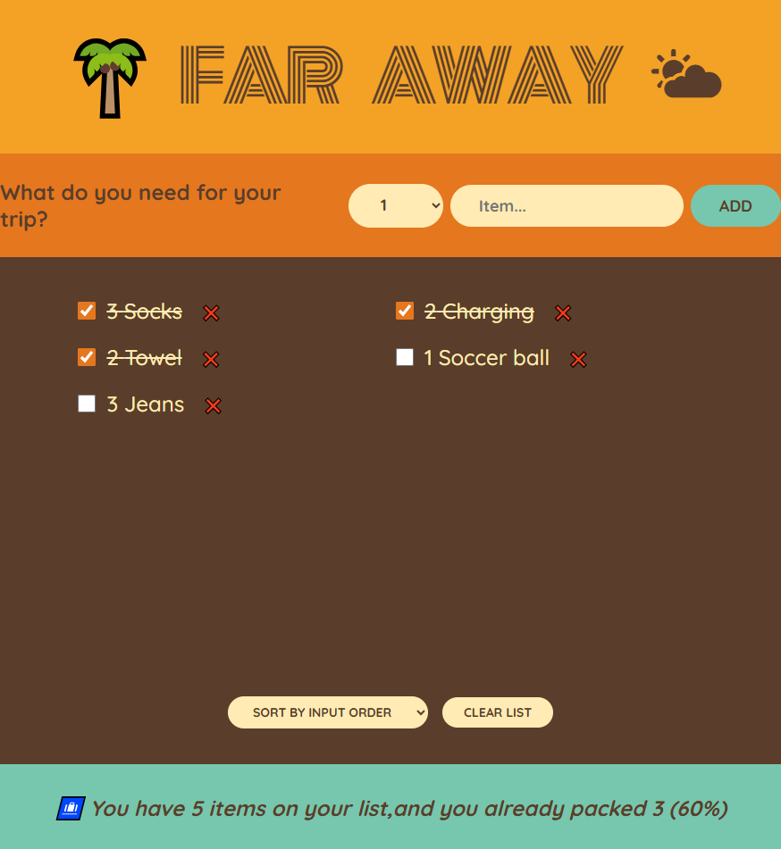

🌴 Far Away Packing List 🌤

This project is a React application that allows users to create and manage a packing list before traveling. Users can add new items, mark them as packed, delete them, and sort the list based on different criteria.

🚀 Features

📌 Add Items: Users can add the items they plan to pack for their trip.
✅ Mark as Packed: Items can be checked off once they are packed.
❌ Delete Items: Users can remove unwanted or mistakenly added items.
🔄 Sort the List: Items can be sorted by input order, description, or packed status.
🗑 Clear All Items: The entire list can be deleted with a single button.
📊 Statistics: The app displays the percentage of packed and unpacked items.

🛠 Technologies Used

React - For building a component-based user interface
React Hooks (useState) - For managing the application state
CSS - For styling the user interface

